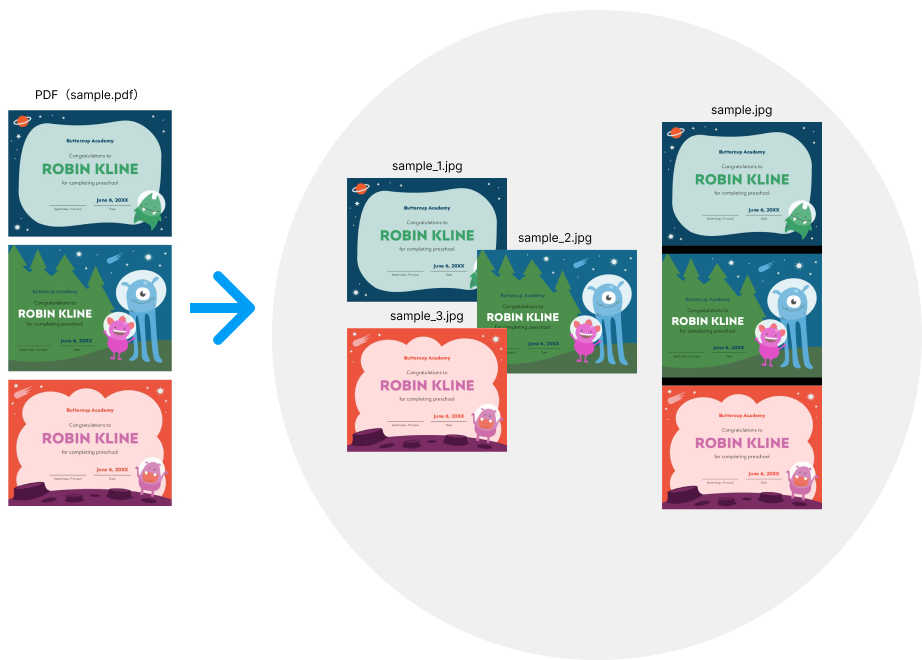

# pdf2thumbnail
Generate PDF thumbnails.  
Click [here](CHANGELOG.md) to see the change log.  


- [pdf2thumbnail](#pdf2thumbnail)
    - [Requirements](#requirements)
    - [Supported OS](#supported-os)
    - [Installation](#installation)
    - [API](#api)
    - [Web Demo](#web-demo)
    - [Testing](#testing)
    - [Author](#author)
    - [License](#license)

## Requirements
- imagemagick CLI >= v6.9.10  
    Installation example:  
    - For instance, if you're on OS X you can use Homebrew.
        ```sh
        brew install imagemagick
        ```
    - For Linux, use yum.  
        ```sh
        sudo yum -y install ImageMagick
        ```

## Supported OS
- Linux
- MAC

## Installation
```sh
npm install --save pdf2thumbnail
```

## API
- ### pdf2thumbnail.getTotalNumberOfPages()
    Get the total number of pages in the PDF document.

    #### Syntax
    ```js
    pdf2thumbnail.getTotalNumberOfPages(pdfPathOrDataUrl);
    ```

    #### Usage
    ```js
    const pdf2thumbnail = require('pdf2thumbnail');

    const totalPages = await pdf2thumbnail.getTotalNumberOfPages('sample.pdf');
    ```

    #### Parameters
    - {string} pdfPathOrDataUrl The path to the PDF file, DataURL.

    #### Return value
    {Promise&lt;number&gt;} Total number of pages in the PDF document.

    #### Throws
    - {TypeError} PDF path is empty.
    - {TypeError} Cannot find file in PDF path.

- ### pdf2thumbnail.writeThumbnails()
    Write a thumbnail for each page of the PDF document.

    #### Syntax
    ```js
    pdf2thumbnail.writeThumbnails(pdfPathOrDataUrl, outputDir);
    pdf2thumbnail.writeThumbnails(pdfPathOrDataUrl, outputDir, {width: 595});
    pdf2thumbnail.writeThumbnails(pdfPathOrDataUrl, outputDir, {width: 595, quality: 100});
    pdf2thumbnail.writeThumbnails(pdfPathOrDataUrl, outputDir, {width: 595, quality: 100, format: 'jpg'});
    pdf2thumbnail.writeThumbnails(pdfPathOrDataUrl, outputDir, {width: 595, quality: 100, format: 'jpg', start: 1});
    pdf2thumbnail.writeThumbnails(pdfPathOrDataUrl, outputDir, {width: 595, quality: 100, format: 'jpg', start: 1, end: 2});
    pdf2thumbnail.writeThumbnails(pdfPathOrDataUrl, outputDir, {width: 595, quality: 100, format: 'jpg', start: 1, end: 2, archive: true});   
    pdf2thumbnail.writeThumbnails(pdfPathOrDataUrl, outputDir, {width: 595, quality: 100, format: 'jpg', start: 1, end: 2, archive: true, background: '#000'});
    pdf2thumbnail.writeThumbnails(pdfPathOrDataUrl, outputDir, {width: 595, quality: 100, format: 'jpg', start: 1, end: 2, archive: true, background: '#000', offset: 30});
    ```

    #### Usage
    - Thumbnail all pages.  
        The thumbnail file name is &quot;&lt;original file name&gt;_&lt;page number&gt;.&lt;extension&gt;&quot;.
        ```js
        const pdf2thumbnail = require('pdf2thumbnail');

        await pdf2thumbnail.writeThumbnails('sample.pdf', './result');
        // $ ll result
        // -rw-rw-r-- 1 ec2-user ec2-user 101656 Dec 20 18:49 sample_1.jpg
        // -rw-rw-r-- 1 ec2-user ec2-user 141934 Dec 20 18:49 sample_2.jpg
        // -rw-rw-r-- 1 ec2-user ec2-user 128636 Dec 20 18:49 sample_3.jpg
        // -rw-rw-r-- 1 ec2-user ec2-user 384545 Dec 20 18:49 sample.jpg
        ```
    - Specify thumbnail width, quality, and format.
        ```js
        const pdf2thumbnail = require('pdf2thumbnail');

        await pdf2thumbnail.writeThumbnails('sample.pdf', './result', {width: 595, quality: 100, format: 'png'});
        // $ ll result
        // -rw-rw-r-- 1 ec2-user ec2-user 106689 Dec 20 18:49 sample_1.png
        // -rw-rw-r-- 1 ec2-user ec2-user 169000 Dec 20 18:49 sample_2.png
        // -rw-rw-r-- 1 ec2-user ec2-user 132571 Dec 20 18:49 sample_3.png
        // -rw-rw-r-- 1 ec2-user ec2-user 361910 Dec 20 18:49 sample.png
        ```
    - Thumbnails for pages 2-3.
        ```js
        const pdf2thumbnail = require('pdf2thumbnail');

        await pdf2thumbnail.writeThumbnails('sample.pdf', './result', {start: 2, end: 3});
        // $ ll result
        // -rw-rw-r-- 1 ec2-user ec2-user 141934 Dec 20 18:49 sample_2.jpg
        // -rw-rw-r-- 1 ec2-user ec2-user 128636 Dec 20 18:49 sample_3.jpg
        // -rw-rw-r-- 1 ec2-user ec2-user 283503 Dec 20 18:49 sample.jpg
        ```
    - An archive containing all thumbnails is also generated at the same time.
        ```js
        const pdf2thumbnail = require('pdf2thumbnail');

        await pdf2thumbnail.writeThumbnails('sample.pdf', './result', {archive: true});
        // ll result*
        // -rw-rw-rw- 1 ec2-user ec2-user 718211 Dec 20 18:04 result.zip

        // result:
        // -rw-rw-r-- 1 ec2-user ec2-user 101656 Dec 20 18:04 sample_1.jpg
        // -rw-rw-r-- 1 ec2-user ec2-user 141934 Dec 20 18:04 sample_2.jpg
        // -rw-rw-r-- 1 ec2-user ec2-user 128636 Dec 20 18:04 sample_3.jpg
        // -rw-rw-r-- 1 ec2-user ec2-user 384545 Dec 20 18:04 sample.jpg
        ```

    #### Parameters
    - {string} pdfPathOrDataUrl The path to the PDF file, DataURL.
    - {string} outputDir Directory path to output thumbnails.
    - {number} options.width? Width of output thumbnail (px). Default is 595 (px).
    - {number} options.xDensity? Horizontal resolution. The unit is dpi and default is 288.
    - {number} options.yDensity? Vertical resolution. The unit is dpi and default is 288.
    - {number} options.quality? The quality of the thumbnail to output (1-100). Default is 100.
    - {string} options.format? The format of the output thumbnail. Default is jpg.
    - {number} options.start? Starting page position starting from 1.
    - {number} options.end? End page position starting from 1.
    - {boolean} options.archive?  
        If true, it generates an archive (.zip) containing all images with the same name as the output directory (outputDir).  
        Default is false.
    - {string|{r: number, g: number, b: number, alpha: number}} options.background?  
        Background color of merged thumbnails.  
        This option accepts a color name, a hex color, or a numerical RGB, RGBA, HSL, HSLA, CMYK, or CMYKA specification.  
        For example, blue, #dddddff, rgb(255,255,255), etc.  
        Default is white.  
    - {number} options.offset? Offset (in pixels) between merged images. Default is 0.

    #### Return value
    {Promise&lt;{thumbnailPaths: string[], mergedPath: string}&gt;} Thumbnail Result.  
    This is an object with the following elements.  
    - {string[]} thumbnailPaths Path list of output thumbnail files.  
        For example, sample_1.jpg, sample_2.jpg.  
    - {string} mergedPath The path of the image file from which the thumbnails for each page are merged.  
        For example, sample.jpg.
    - {string} archivePath? The path to the archive containing all thumbnails.  
        This is only set if the archive option is true when creating thumbnails.

    #### Throws
    - {TypeError} PDF path is empty.
    - {TypeError} Cannot find file in PDF path.
    - {TypeError} The width option is not a number greater than 1.
    - {TypeError} The quality option is not a number between 1 and 100.
    - {TypeError} The start option is not a number greater than 1.
    - {TypeError} The end option is not a number greater than 1.
    - {TypeError} The offset option is not a number greater than 0.

## Web Demo
Click [here](demo/README.md) to learn how to use the web demo.    

## Testing
With [npm](http://npmjs.org) do:

```sh
npm test
```

## Author
**Takuya Motoshima**

* [github/takuya-motoshima](https://github.com/takuya-motoshima)
* [twitter/TakuyaMotoshima](https://twitter.com/TakuyaMotoshima)
* [facebook/takuya.motoshima.7](https://www.facebook.com/takuya.motoshima.7)

## License
[MIT](LICENSE)