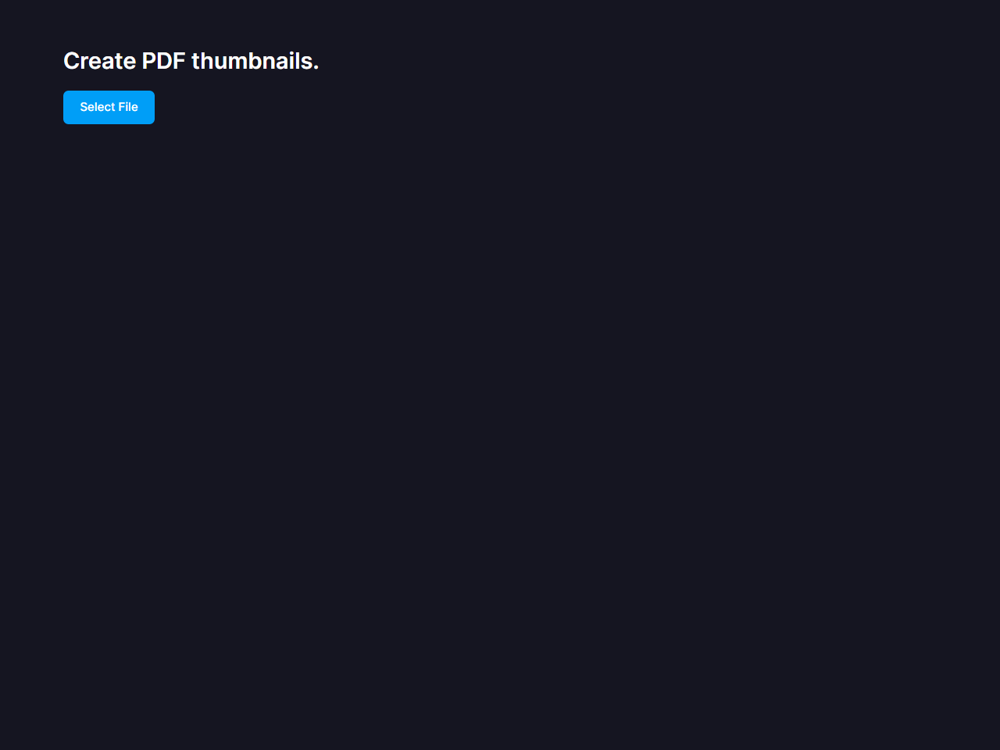
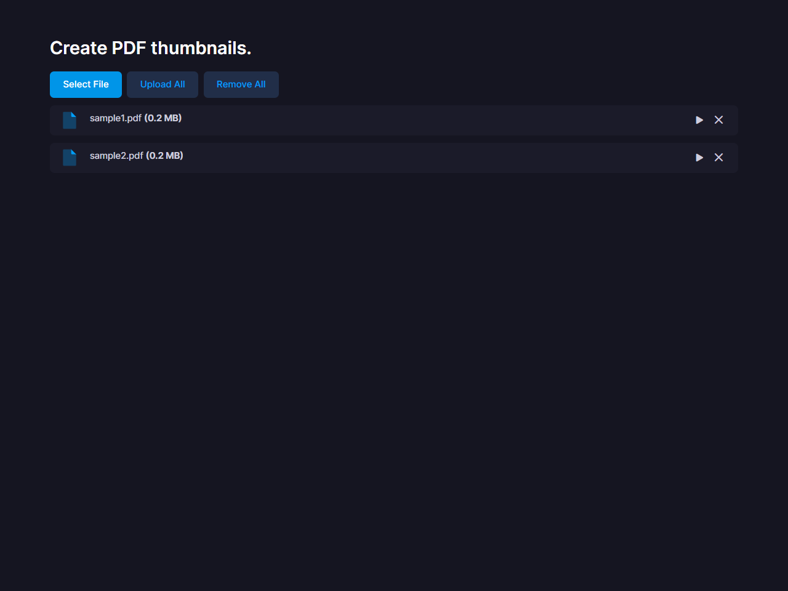
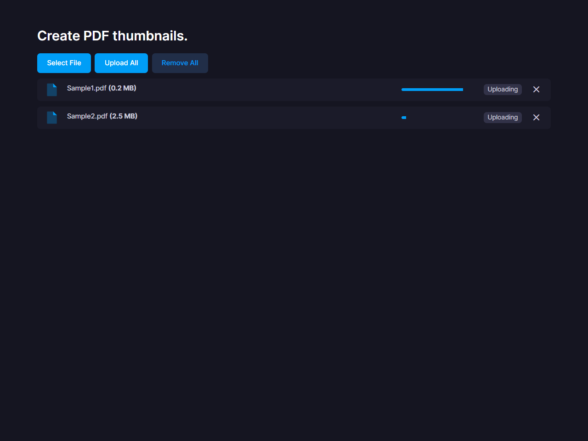
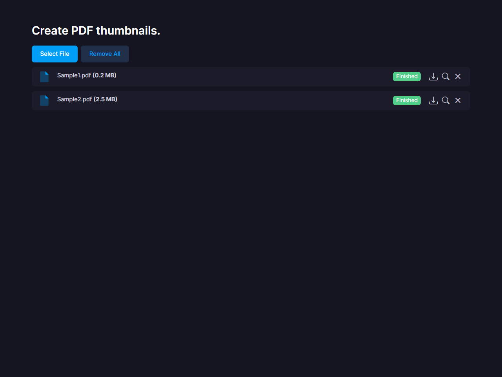

# pdf2thumbnail web demo

## Getting Started
1. Install dependencies.
    ```sh
    npm install
    ```
1. Start the server.
    ```sh
    npm start
    ```
1. Open http://localhost:8080/ in your browser.  
    

## Usage
1. Click the &quot;Select File&quot; button and select the PDF document for which you wish to generate thumbnail images.  
    
1. &quot;Upload All&quot; button allows you to upload all files, &quot;&quot; button allows you to upload only selected files.  
    
1. Once the thumbnail creation is complete, you can download the thumbnail by clicking on the &quot;&quot; button and preview the thumbnail by clicking on the &quot;&quot; button.  
    